# 📊 Smart Categorizer - Visual Flowcharts

> Mermaid diagrams for the Smart Categorizer Agent. View in GitHub, GitLab, or any Mermaid-compatible viewer.

---

## 1. High-Level Architecture

```mermaid
flowchart TB
    subgraph Input["📥 INPUT"]
        MSG[/"Slack Message"/]
        CH[/"Channel Info"/]
    end

    subgraph Processing["⚙️ AGENT PROCESSING"]
        INIT["Initialize Agent"]
        TOOLS["Tool Execution"]
        LLM["LLM Decision"]
    end

    subgraph Decision["📋 DECISION"]
        ASSIGN["✅ Assign to<br/>Existing Topic"]
        CREATE["🆕 Create<br/>New Topic"]
    end

    subgraph Storage["💾 STORAGE"]
        WV[(Weaviate DB)]
        MEM["In-Memory<br/>Context"]
    end

    subgraph Output["📤 OUTPUT"]
        RES[/"Result Object"/]
    end

    MSG --> INIT
    CH --> INIT
    
    INIT --> TOOLS
    TOOLS --> LLM
    LLM -->|Need More Info| TOOLS
    LLM -->|Decision Made| Decision
    
    ASSIGN --> WV
    CREATE --> WV
    WV --> MEM
    MEM --> RES

    style INIT fill:#FFB6C1
    style LLM fill:#87CEEB
    style WV fill:#90EE90
```



---

## 2. Main Categorization Flow


---

## 3. Agent Tool-Calling Loop

```mermaid
sequenceDiagram
    autonumber
    participant User as User Message
    participant Agent as LLM Agent
    participant Tools as Tool Handlers
    participant DB as Weaviate DB

    User->>Agent: "Categorize: 'حله'"
    
    Note over Agent: Iteration 1
    Agent->>Agent: Think: "Short message,<br/>need context"
    Agent->>Tools: get_conversation_context(5)
    Tools->>DB: Fetch recent messages
    DB-->>Tools: Messages + topics
    Tools-->>Agent: {messages: [...]}
    
    Note over Agent: Iteration 2
    Agent->>Agent: Think: "Recent msg about<br/>database migration"
    Agent->>Tools: get_all_topics()
    Tools->>DB: Query all topics
    DB-->>Tools: Topic list
    Tools-->>Agent: {topics: [...]}
    
    Note over Agent: Iteration 3 (Final)
    Agent->>Agent: Think: "Confirmation to<br/>db discussion"
    Agent->>Tools: assign_to_topic(<br/>id="abc-123",<br/>name="Database Migration")
    
    Note over Tools: DECISION MADE
    Tools-->>Agent: {action: "assign", ...}
    
    Agent->>DB: Store message + link
    Agent-->>User: Result object
```



---

## 4. Topic Duplicate Detection

```mermaid
flowchart TD
    subgraph Input["📥 Proposed Topic"]
        NAME["name: 'DB Performance'"]
        DESC["desc: 'Database perf issues'"]
        KW["keywords: ['db', 'slow']"]
    end

    subgraph Normalize["🔄 Normalization"]
        N1["DB → database"]
        N2["lowercase"]
        N3["remove special chars"]
    end

    subgraph Compare["📊 Compare with Each Existing Topic"]
        EX["Existing: 'Database Performance'"]
        
        subgraph Scores["Score Calculation"]
            S1["Name Similarity<br/>Levenshtein: 0.85"]
            S2["Desc Similarity<br/>Levenshtein: 0.70"]
            S3["Keyword Overlap<br/>Fuzzy Set: 0.60"]
        end
        
        COMBINED["Combined Score<br/>(0.85×0.5) + (0.70×0.2) + (0.60×0.3)<br/>= 0.745 (74.5%)"]
    end

    subgraph Decision["📋 Recommendation"]
        D1{Score >= 0.70?}
        USE["✅ USE EXISTING<br/>'Database Performance'"]
        D2{Score >= 0.50?}
        MERGE["⚠️ CONSIDER MERGE"]
        CREATE["🆕 SAFE TO CREATE"]
    end

    NAME --> N1
    DESC --> N2
    KW --> N3
    
    N1 --> EX
    N2 --> EX
    N3 --> EX
    
    EX --> S1
    EX --> S2
    EX --> S3
    
    S1 --> COMBINED
    S2 --> COMBINED
    S3 --> COMBINED
    
    COMBINED --> D1
    D1 -->|Yes| USE
    D1 -->|No| D2
    D2 -->|Yes| MERGE
    D2 -->|No| CREATE

    style USE fill:#90EE90
    style MERGE fill:#FFD700
    style CREATE fill:#87CEEB
```



---

## 5. Database Entity Relationship

```mermaid
erDiagram
    Topic ||--o{ SlackMessage : "has many"
    
    Topic {
        uuid id PK
        string name "Database Migration"
        string description "Messages about db migration"
        array keywords "['postgres', 'sql']"
        array users "['Hossein', 'Ali']"
        string combinedSearchText "for embedding"
        int messageCount 42
        datetime createdAt
        datetime updatedAt
    }
    
    SlackMessage {
        uuid id PK
        string text "let's migrate to postgres"
        string user "U123ABC"
        string userName "Hossein Molavi"
        string timestamp "1234567890.001"
        string channelId "C123ABC"
        string channelName "dev-team"
        string threadTs "nullable"
        datetime processedAt
        uuid topicId FK
    }
```

---

## 6. Tool Categories and Usage


---

## 7. Message Type Decision Tree

```mermaid
flowchart TD
    MSG((Message)) --> TYPE{Message<br/>Type?}
    
    TYPE -->|Thread Reply| TR[Get Thread Parent]
    TR --> TR_TOPIC{Parent has<br/>Topic?}
    TR_TOPIC -->|Yes| TR_ASSIGN["✅ ASSIGN<br/>Same as Parent"]
    TR_TOPIC -->|No| TR_CATEGORIZE[Categorize Parent First]
    
    TYPE -->|Short < 15 chars| SHORT[Get Recent Context]
    SHORT --> SHORT_CTX{Has Recent<br/>Message?}
    SHORT_CTX -->|Yes| SHORT_ASSIGN["✅ ASSIGN<br/>Same as Recent"]
    SHORT_CTX -->|No| SHORT_SEARCH[Search Topics]
    
    TYPE -->|Substantive| SUB[Find Best Match]
    SUB --> SUB_CONF{Confidence<br/>>= 75%?}
    SUB_CONF -->|Yes| SUB_ASSIGN["✅ ASSIGN<br/>to Match"]
    SUB_CONF -->|No| SUB_VAL{Confidence<br/>>= 50%?}
    SUB_VAL -->|Yes| SUB_REVIEW[Review Match]
    SUB_VAL -->|No| SUB_NEW[Validate New Topic]
    
    SUB_NEW --> NEW_CHECK{Is Duplicate?}
    NEW_CHECK -->|Yes| NEW_USE["✅ ASSIGN<br/>to Existing"]
    NEW_CHECK -->|No| NEW_CREATE["🆕 CREATE<br/>New Topic"]

    style TR_ASSIGN fill:#90EE90
    style SHORT_ASSIGN fill:#90EE90
    style SUB_ASSIGN fill:#90EE90
    style NEW_USE fill:#90EE90
    style NEW_CREATE fill:#87CEEB
```



---

## 8. System Component Interaction


---

## 9. Agent Iteration Timeline


---

## 10. Fallback Logic


---

## Quick Reference Card

| Flow | Diagram | Use Case |
|------|---------|----------|
| #1 | Architecture | System overview |
| #2 | Main Flow | Complete process |
| #3 | Agent Loop | Tool-calling sequence |
| #4 | Duplicate Detection | Topic validation |
| #5 | ER Diagram | Database schema |
| #6 | Tool Mind Map | Tool categories |
| #7 | Decision Tree | Message routing |
| #8 | Components | System interaction |
| #9 | Timeline | Processing timing |
| #10 | Fallback | Error handling |

---

*Generated for Smart Categorizer v1.1 (Agent Mode with User Tracking)*
